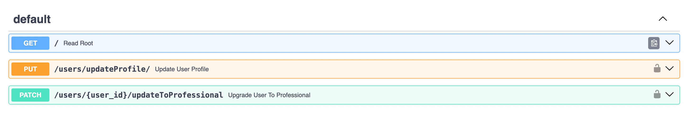

# Final Project: User Management System - Feature 9

## Implemented Features

### 1. Profile Management
- Implemented functionality allowing users to update their profile fields such as name, bio, and location.

**API Endpoint:**
```
/users/updateProfile
```
- Enables users to modify their profile data effortlessly.



---

### 2. User Status Upgrade
- Developed functionality for specific roles such as managers and admins to upgrade a user's status to "professional".

**API Endpoint:**
```
/users/{user_id}/updateToProfessional
```

---

### 3. Email Notification System 
- Added automatic email notifications to inform users when their status is upgraded to "professional". 
---

## Issues Resolved 
1. **Updated Workflow File to Fix Docker Build Issues and Version Control** - [Issue 1 Link](https://github.com/HariniV02/user_management/tree/1-email_verification)
2. **Missing Password Validation During Registration** - [Issue 2 Link](https://github.com/HariniV02/user_management/tree/3-password-validation)
3. **Profile Picture URL Validation** - [Issue 3 Link](https://github.com/HariniV02/user_management/tree/2-profile-update)
4. **No Default Role Assigned During User Creation** - [Issue 4 Link](https://github.com/HariniV02/user_management/tree/4-default-role)
5. **Email Verification** - [Issue 5 Link](https://github.com/HariniV02/user_management/tree/5-docker-build-issues)

**GitHub Issues:** [GitHub Issues Link](https://github.com/HariniV02/user_management/issues)

---

## Test Cases 
- **Added 10+ Test Cases:**
 **Link to Test Cases:** [Test Cases](https://github.com/HariniV02/user_management/tree/tests?tab=readme-ov-file)

 **Note:** 
    - Not all of the test cases are in this branch, I updated the tests in each specific branch. All 10 will be in the reflection document below. 


---

## Deployment 
   - **DockerHub Repository:** [DockerHub Link](https://hub.docker.com/repository/docker/hariniv02/user_management/general)

---

## Reflection Document 
Prepare a **1-2 page Word document** summarizing your journey, key learnings, and achievements during the project. Include:
- Links to the closed issues:
   - **5 QA Issues**, **10 Test Cases**, and **1 Feature**.
- Successful deployment details:
   - Link to your DockerHub repository.

